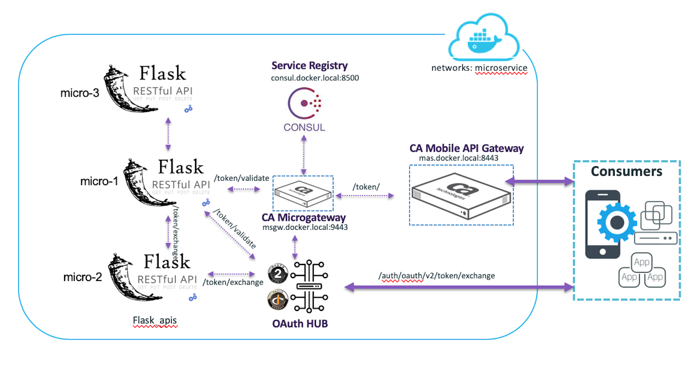

# Mobile to Microservice Demo: Microservice creation, discovery, consumption, and enforcement 

The folder structure contains the iOS app and Docker application. Navigate to the [Docker README](docker) to get started.

## Build Requirements
*   [Add License Dependencies](docker/config/README.md)
*   [Add OTK SSKAR Dependencies](docker/files/mas/OTK_Installers/README.md)
*   [Add MAG SSKAR Dependencies](docker/files/mas/MAG_Installers/README.md)

## Mobile to Microservice Architecture

## token_bridge architecture

## iOS Splash Screen

  

